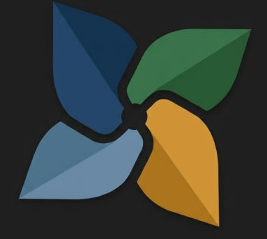
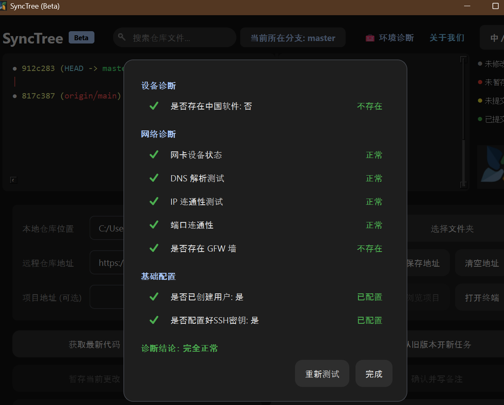
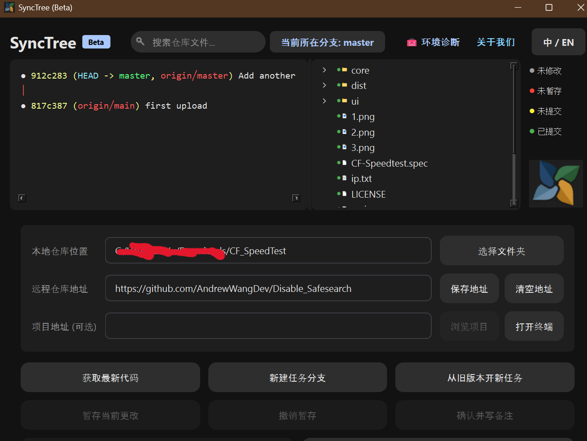

....

<div align="center">
  
  <h1>SyncTree (Beta)</h1>
</div>

<div align="center">
  
  <br>
  
</div>


**SyncTree** is a lightweight, fully fool-proof Git graphical desktop client developed based on `PySide6`.  
It is tailored for Git beginners and developers who need a pure, zero-mental-burden code version management tool.

---

## 🚀 Core Features

- **Ultimate Fool-Proof Interaction**: Based on a strict state machine polling mechanism (background checking via `QTimer`), any operation buttons that do not conform to the current Git state will be automatically disabled (semi-transparent), rejecting all error tree states caused by incorrect command combinations.
- **Modern Material You Dark UI**: An immersive dark theme, custom-drawn water ripple button effects, discarding the traditional system `QMessageBox` in favor of a home-brewed `Modal` with a smooth fade-in blurred background, and unobtrusive bottom `Toast` notifications.
- **Git Graph (ANSI Color Parsing)**: Transforms the boring `git log` advanced formatting by perfectly parsing ANSI terminal color escape codes at the UI layer, replacing and connecting them using special Unicode monospace geometric characters (`●, │`).
- **Automated PR / MR Generation**: Native silent execution of background commands when pushing code, supporting intelligent regex sniffing of GitLab/Github generated Pull Request URLs and opening them directly in the default browser to share with the team seamlessly.
- **Multi-Language Support (EN/CN)**: An independent `i18n` module supports seamless refreshing and redrawing of all characters at the UI layer.
- **Rich Diagnostic Toolkit**: Integrates deep connection probing mechanics that natively ping loopback adapters, resolve network APIs automatically, and evaluate presence of GFW blockers when detecting asynchronous sync/push failures.

---

## 🛠 Technology Stack

- **Python 3.10+** (Core Development Language)
- **PySide6** (Qt for Python, cross-platform modern high-performance GUI and animations)
- **Subprocess Module** (Used for interacting with the underlying pure Git Core system, forcing `CREATE_NO_WINDOW` on all commands to evade any CMD black window flashing)

---

## 📦 Project Structure

```text
SimpleG/
├── requirements.txt      # Dependency package list
├── build.py              # PyInstaller packaging & build script
├── main.py               # Project application entry point
├── core/
│   ├── config.py         # User local configuration & persistence
│   ├── git_actions.py    # Specific execution strategies & command structures
│   ├── git_utils.py      # Background QThread state polling & subprocess capturing
│   ├── i18n.py           # Internationalization language dictionaries
│   ├── network_diag.py   # Connectivity diagnostics thread utility
│   └── state.py          # Core Git data state definition Dataclass
└── ui/
    ├── components/
    │   ├── buttons.py    # Qt water ripple component redrawing
    │   ├── modals.py     # Modal windows, overlays, blur processing
    │   └── toast.py      # Lightweight message notification popup
    ├── graph_view.py     # View component dedicated to rendering Git Log ANSI and Unicode graphics
    ├── panel_view.py     # Lower 60% working pipeline area panel
    ├── theme.py          # Stylesheets, Theme color palettes
    └── window.py         # MainWindow main form glue layer
```

---

## 🏃 Quick Start

### 1. Prerequisites

Ensure your operating system has the latest native **Git** environment installed (`git --version`), and a **Python 3.10+** environment is required.

### 2. Download and Run

```bash
git clone https://github.com/AndrewWangDev/SyncTree
cd SyncTree
pip install -r requirements.txt
python main.py
```

### 3. Build and Publish as Standalone `.exe`

```bash
python build.py
```

> The output will be located in the newly created `dist/synctree.exe` directory.

---

## 📄 License

This software is released under the **[GNU General Public License v2.0 (GPL-2.0)](https://www.gnu.org/licenses/old-licenses/gpl-2.0.html)**.  
Because SyncTree operates natively as a client wrapper interacting directly with core Git binaries, it adheres identically to the open-source distribution constraints and licensing terms set structurally by the official Git project ecosystem limit.

---

## 👨‍💻 Author

Developed / Designed with ❤️ by **[Andrew Wang Dev](https://andrewwangdev.com/about/)**.

....
